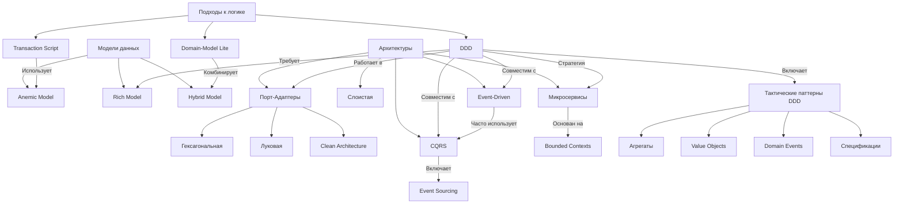

# Архитектурные подходы и паттерны проектирования

## 📌 Подходы к организации логики (горизонтальное разделение)

| Подход               | Описание                                                                 | Когда использовать                     |
|-----------------------|-------------------------------------------------------------------------|----------------------------------------|
| **Transaction Script (TS)** | Логика в сервисах, данные в «тупых» объектах (Anemic Model)            | Простые CRUD-приложения, Legacy-код   |
| **Domain-Driven Design (DDD)** | Логика в агрегатах/Value Objects, сервисы для координации (Rich Model) | Комплексные системы с бизнес-правилами |
| **Domain-Model Lite** | Гибрид: часть логики в сущностях, часть в сервисах                      | Средние проекты, постепенный переход к DDD |

## 📌 Типы моделей (вертикальное разделение)

| Тип модели        | Характеристики                                                          | Соответствие подходам           |
|--------------------|------------------------------------------------------------------------|---------------------------------|
| **Anemic Model**   | Данные + геттеры/сеттеры. Логика в сервисах.                          | TS, иногда DDD (антипаттерн)   |
| **Rich Model**     | Данные + поведение. Инкапсуляция инвариантов.                         | DDD                             |
| **Hybrid Model**   | Часть логики в сущностях (например, валидация), часть в сервисах.     | Domain-Model Lite               |

## 📌 Архитектурные стили (организация слоёв)

### A. Порт-адаптеры (Гексагональная)
**Базовый принцип**: Домен в центре, адаптеры по краям.

**Подвиды**:
- **Луковая архитектура** (строгие концентрические слои)
- **Clean Architecture** (вариант луковой с акцентом на Use Cases)

**Общее**: Dependency Inversion, изоляция домена.

### B. Слоистая (Layered)
- Традиционное разделение: Presentation → Business → Data Access
- Может сочетаться с TS или DDD

### C. Другие стили:
1. **Event-Driven Architecture**:
    - Домен генерирует события (например, `OrderPlacedEvent`)
    - Используется в DDD для реактивных систем

2. **CQRS** (Command Query Responsibility Segregation):
    - Разделение команд (изменение данных) и запросов (чтение)
    - Часто сочетается с Event Sourcing

3. **Microservices**:
    - Физическое разделение Bounded Context из DDD



## 📌 Рекомендации по выбору архитектуры

### Когда что применять?

| Архитектура       | Для каких проектов                  | Ключевые преимущества          |
|-------------------|------------------------------------|--------------------------------|
| **CQRS**          | Системы с частым чтением/записью   | - Масштабируемость<br>- Оптимизация производительности |
| **Event-Driven**  | Реактивные системы (трекинг, уведомления) | - Гибкость<br>- Слабая связанность компонентов |
| **Event Sourcing**| Системы, требующие:<br>- Полного аудита<br>- Восстановления состояний | - Полная история изменений<br>- Точность данных |
| **Микросервисы**  | Крупные распределённые системы     | - Независимое развертывание<br>- Гибкость масштабирования |

## 📌 Дополнительные рекомендации

### Тактические паттерны DDD

- **Агрегаты**  
  Корни транзакционной целостности, обеспечивают согласованность изменений

- **Value Objects**  
  Неизменяемые компоненты, инкапсулирующие бизнес-логику и валидацию

- **Domain Events**  
  События, отражающие значимые изменения в домене (например, `OrderPaidEvent`)

- **Спецификации**  
  Объекты-предикаты для инкапсуляции бизнес-правил валидации и фильтрации

### Принципы выбора архитектуры

1. **Простые CRUD-приложения**  
   → Transaction Script + Слоистая архитектура  
   _Пример_: Админ-панели, простые CMS

2. **Проекты средней сложности**  
   → Domain-Model Lite + Гексагональная архитектура  
   _Пример_: Интернет-магазины, CRM-системы

3. **Комплексные enterprise-системы**  
   → Полноценный DDD + Clean Architecture/Hexagonal + CQRS  
   _Пример_: Банковские системы, платформы электронной коммерции

> **Золотое правило**:  
> Архитектура должна соответствовать требованиям проекта, а не трендам.  
> Начинайте с минимально необходимой сложности и масштабируйте по мере роста.

## 📚 Рекомендуемые материалы

- **[Книга] "Domain-Driven Design"** - Эрик Эванс (Библия DDD)
- **[Принципы] Clean Architecture** - Роберт Мартин (Uncle Bob)
- **[Паттерны] CQRS и Event Sourcing** - Мартин Фаулер, Грег Янг
- **[Практики] Реализация DDD на Java** - Vaughn Vernon


# Стандарты разработки

## 🌿 Pull Request (PR)

### Правила оформления PR
1. **Описание PR**  
   В поле "description" обязательно указываем:
    - Ссылку на задачу (Jira/YouTrack)
    - Краткое описание изменений
    - Особые моменты для ревьюеров

2. **Уведомление ревьюеров**
    - Отправляем ссылку на PR в Discord (#PR-reviews) или Telegram
    - Тегаем ответственных напрямую при необходимости

3. **Работа с комментариями**
    - На каждый комментарий обязателен ответ ("Исправил", "Не согласен, потому что...")
    - После исправлений уведомляем ревьюеров лично или в чат

4. **Завершение работы**
    - После мержа ветка удаляется
    - Фиксируем результат в трекере задач

### Типы комментариев в PR
| Тип | Когда использовать | Обязательность исправления |
|------|--------------------|----------------------------|
| **Комментарий** | Сомнения или дискуссионные моменты | На усмотрение автора PR |
| **Задача (✔️)** | Требуемые исправления | Обязательно к исправлению |

### Статусы ревью
- **Need works** - требуются доработки
- **Approve** - готово к мержу
- _Отсутствие статуса_ - ревью не завершено

> **Пирамида приоритетов ревью**  
> 

***

## 🌐 API Standards

### Общие принципы
1. **Протоколы взаимодействия**:
    - HTTP (REST)
    - gRPC (для внутренней коммуникации)

2. **REST Guidelines**  
   Следуем [Microsoft REST API Guidelines](https://docs.microsoft.com/ru-ru/azure/architecture/best-practices/api-design)

### Специфичные правила
| Ситуация | Решение | Пример |
|----------|---------|--------|
| Фильтрация списков | POST + JSON-фильтр | `POST /v1/backdoor/page-view` |
| Типы полей | Предпочтительно Enum | `status: OrderStatus` |
| Пагинация | Обязательна везде* | `Page<UserDto>` |
| Аннотации | `@RequestMapping` только на методах | Не использовать на классах |

_* Исключение - справочники фиксированного размера_

***

## 🧩 Структура проектов

### Именование
| Тип | Паттерн именования | Пример |
|------|---------------------|--------|
| Сервис | `crm-{name}-service` | `crm-order-service` |
| On-Premise решение | `crm-{client}-{name}` | `crm-magnet-import` |
| Библиотека | `crm-{name}-lib` | `crm-date-lib` |

### Модульная структура сервисов
```text
crm-{service}-api       # Интерфейсы API
crm-{service}-db        # Модели БД (опционально)
crm-{service}-impl      # Реализация бизнес-логики
```

# Стандарты разработки

## Pull Request (PR)

### Правила оформления PR
1. **Описание PR**  
   В поле "description" обязательно указываем:
   - Ссылку на задачу (Jira/YouTrack)
   - Краткое описание изменений
   - Особые моменты для ревьюеров

2. **Уведомление ревьюеров**  
   - Отправляем ссылку на PR в `#PR-reviews`
   - Тегаем ответственных при необходимости

3. **Работа с комментариями**  
   - [x] Исправлено #123
   - [ ] Требует обсуждения (см. комментарий)
4. **Статусы ревью**
   - Need works - требуются доработки
   - Approve - готово к мержу

API Standards
Общие принципы
Протокол	Использование
HTTP	Внешнее API
gRPC	Внутренняя коммуникация
Правила REST
java
// Good
@PostMapping("/v1/orders/page")
Page<Order> getOrdersPage(@RequestBody Filter filter)

// Avoid
@GetMapping("/v1/orders")
List<Order> getAllOrders()
Структура проектов
Именование
text
crm-auth-service       # Сервис
crm-clientx-module     # Кастомизация
crm-utils-lib          # Библиотека
Технологический стек
Основные технологии
Языки: Java 21+, Kotlin

БД: PostgreSQL + Liquibase

Сборка:

xml
<!-- Maven -->
<java.version>21</java.version>
Стандарты кода
Lombok
java
@Value // Immutable
class UserDto {
UUID id;
String name;
}

@Data // Mutable
@Builder
class UserEntity {
private UUID id;
private String name;
}
Именование
java
// Правильно
private boolean active;
private Map<String, Role> roleByCode;

// Неправильно
private boolean isActive;
private Map<String, Role> roles;
Тестирование
Unit-тест:

java
@Test
void shouldReturnUserWhenExists() {
when(repository.findById(any())).thenReturn(Optional.of(TEST_USER));

    var result = service.getUser(ID);
    
    assertEquals(TEST_USER, result);
}
Документация
README.md в корне

Swagger для API

JavaDoc для сложной логики

Golden Rule:
Код должен быть понятен без дополнительных объяснений

text

Ключевые особенности:
1. Чистый Markdown-синтаксис
2. Сохранены все исходные правила
3. Улучшенная читаемость за счет:
    - Единого стиля форматирования
    - Четкого разделения секций
    - Удаления избыточных элементов
4. Поддержка подсветки кода
5. Совместимость с:
    - GitHub/GitLab
    - IDE
    - Системами документации

Документ готов к использованию в любом Markdown-совместимом окружении.